# Diagrama de Classes - Sistema de Eventos

## Diagrama Mermaid

```mermaid
classDiagram
    class SistemaEventos {
        -GerenciadorEventos gerenciadorEventos
        -GerenciadorUsuarios gerenciadorUsuarios
        -Scanner scanner
        -DateTimeFormatter formatterData
        -DateTimeFormatter formatterDataHora
        +iniciar()
        -menuPrincipal()
        -menuUsuario()
        -registrarUsuario()
        -fazerLogin()
        -verEventosPublicos()
        -verTodosEventos()
        -verEventosFuturos()
        -verEventosAcontecendo()
        -verEventosPassados()
        -buscarPorCategoria()
        -buscarPorNome()
        -participarEvento()
        -verMeusEventos()
        -cancelarParticipacao()
        -criarEvento()
        -verEstatisticas()
        -lerInteiro()
        -lerData()
        -lerDataHora()
    }

    class GerenciadorEventos {
        -List~Evento~ eventos
        -String ARQUIVO_EVENTOS
        -DateTimeFormatter FORMATTER
        +adicionarEvento(Evento)
        +removerEvento(Evento)
        +getTodosEventos()
        +getEventosOrdenadosPorProximidade()
        +getEventosFuturos()
        +getEventosAcontecendo()
        +getEventosPassados()
        +buscarPorCategoria(CategoriaEvento)
        +buscarPorNome(String)
        +encontrarPorId(int)
        +getEstatisticas()
        -salvarEventos()
        -carregarEventos()
        -parseEventoFromFile(String)
    }

    class GerenciadorUsuarios {
        -List~Usuario~ usuarios
        -Usuario usuarioLogado
        -String ARQUIVO_USUARIOS
        -DateTimeFormatter FORMATTER
        +registrarUsuario(Usuario)
        +fazerLogin(String)
        +fazerLogout()
        +getUsuarioLogado()
        +isUsuarioLogado()
        +buscarPorEmail(String)
        +getTodosUsuarios()
        -salvarUsuarios()
        -carregarUsuarios()
        -usuarioToFileString(Usuario)
        -parseUsuarioFromFile(String)
    }

    class Usuario {
        -String nome
        -String email
        -String telefone
        -LocalDate dataNascimento
        -String endereco
        -List~Evento~ eventosParticipando
        +Usuario(String, String, String, LocalDate, String)
        +getNome()
        +setNome(String)
        +getEmail()
        +setEmail(String)
        +getTelefone()
        +setTelefone(String)
        +getDataNascimento()
        +setDataNascimento(LocalDate)
        +getEndereco()
        +setEndereco(String)
        +getEventosParticipando()
        +adicionarEvento(Evento)
        +removerEvento(Evento)
        +estaParticipando(Evento)
        +toString()
    }

    class Evento {
        -String nome
        -String endereco
        -CategoriaEvento categoria
        -LocalDateTime horario
        -String descricao
        -List~Usuario~ participantes
        -int id
        -static int proximoId
        +Evento(String, String, CategoriaEvento, LocalDateTime, String)
        +Evento(int, String, String, CategoriaEvento, LocalDateTime, String)
        +getId()
        +getNome()
        +setNome(String)
        +getEndereco()
        +setEndereco(String)
        +getCategoria()
        +setCategoria(CategoriaEvento)
        +getHorario()
        +setHorario(LocalDateTime)
        +getDescricao()
        +setDescricao(String)
        +getParticipantes()
        +adicionarParticipante(Usuario)
        +removerParticipante(Usuario)
        +temParticipante(Usuario)
        +getNumeroParticipantes()
        +jaOcorreu()
        +estaAcontecendo()
        +vaiAcontecer()
        +toFileString()
        +toString()
        +equals(Object)
        +hashCode()
    }

    class CategoriaEvento {
        <<enumeration>>
        FESTA
        EVENTO_ESPORTIVO
        SHOW
        CONFERENCIA
        WORKSHOP
        EXPOSICAO
        TEATRO
        CINEMA
        GASTRONOMIA
        CULTURAL
        RELIGIOSO
        EDUCACIONAL
        OUTROS
        -String descricao
        +getDescricao()
        +toString()
    }

    %% Relacionamentos
    SistemaEventos --> GerenciadorEventos : usa
    SistemaEventos --> GerenciadorUsuarios : usa
    GerenciadorEventos --> Evento : gerencia
    GerenciadorUsuarios --> Usuario : gerencia
    Evento --> CategoriaEvento : tem
    Evento --> Usuario : tem participantes
    Usuario --> Evento : participa de
```

## Descrição das Classes

### SistemaEventos
- **Responsabilidade**: Interface principal do sistema, controla o fluxo de navegação e interação com o usuário
- **Características**: Implementa o padrão MVC como controlador principal

### GerenciadorEventos
- **Responsabilidade**: Gerencia todos os eventos do sistema, incluindo persistência em arquivo
- **Características**: Implementa operações CRUD e consultas específicas

### GerenciadorUsuarios
- **Responsabilidade**: Gerencia usuários do sistema, incluindo autenticação e persistência
- **Características**: Controla login/logout e registro de usuários

### Usuario
- **Responsabilidade**: Representa um usuário do sistema
- **Atributos**: Nome, email, telefone, data de nascimento, endereço (mais de 3 atributos conforme solicitado)
- **Características**: Mantém lista de eventos em que participa

### Evento
- **Responsabilidade**: Representa um evento no sistema
- **Atributos obrigatórios**: Nome, endereço, categoria, horário, descrição
- **Características**: Controla participantes e verifica status temporal

### CategoriaEvento
- **Responsabilidade**: Define categorias disponíveis para eventos
- **Características**: Enum com categorias predefinidas (festas, eventos esportivos, shows, etc.)

## Padrões Arquiteturais Utilizados

1. **MVC (Model-View-Controller)**: 
   - Model: Usuario, Evento, CategoriaEvento
   - View: Interface console (métodos de exibição)
   - Controller: SistemaEventos, GerenciadorEventos, GerenciadorUsuarios

2. **Repository Pattern**: GerenciadorEventos e GerenciadorUsuarios atuam como repositórios

3. **Singleton Pattern**: Implícito nos gerenciadores (uma instância por sistema)

## Funcionalidades Implementadas

✅ Sistema de registro e notificação de eventos
✅ Registro de usuários com mais de 3 atributos
✅ Registro de eventos com atributos obrigatórios
✅ Categorias de eventos definidas
✅ Consulta e participação em eventos
✅ Cancelamento de participação
✅ Ordenação por proximidade temporal
✅ Verificação de eventos em andamento
✅ Persistência em arquivo events.data
✅ Carregamento automático na inicialização
✅ Interface console completa

